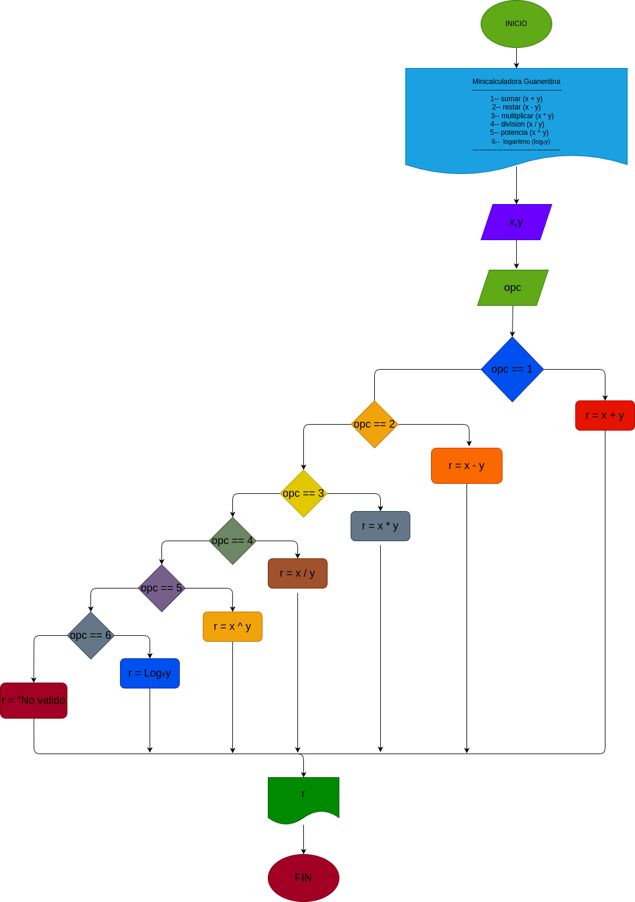

# minicalculadora_guanentina

Programa capas de hacer operaciones matematicas sencillas

# Analisis

## Input

### Variables de entrada
x: Primer número de la operación.

y: Segundo número de la operación.

opc: Número correspondiente a las diferentes operaciones posibles.

### prosesisng

opc: Determina la operación a realizar.

Operaciones disponibles:

 1) Suma: r = x + y

 2) Resta: r = x - y

 3) Multiplicación: r = x * y

 4) División: r = x / y

 5) Potencia: r = x^y

 6) Logaritmo: r = log base y de x

Si opc no es válido, el resultado será "No válido".

### output
r: Resultado de la operación seleccionada.
# Diseño

 
# Construcción